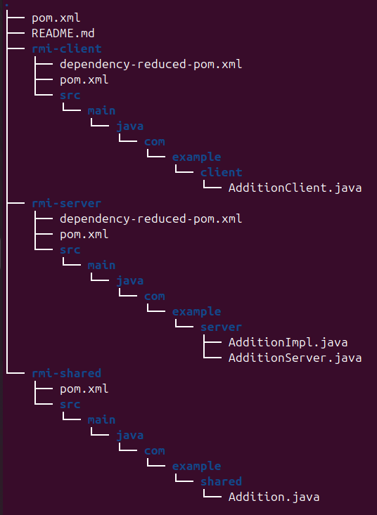

# RMI Addition

This is a Maven project for a Java RMI (Remote Method Invocation) application. The project consists of a server that provides an RMI service to add two numbers and a client that calls this service.

## Project Structure

The project is organized as follows:



## Explanation of Each Part

### 1. rmi-shared
- Defines a remote method `add` that takes two integers and returns their sum.

### 2. rmi-server
- Sets up an RMI registry on port 1099 and binds the `AdditionService` so clients can look it up.
- Implements the `Addition` interface and provides the actual logic for the `add` method.

### 3. rmi-client
- Connects to the RMI registry on localhost, retrieves the `AdditionService`, and calls the `add` method with two numbers.

## Running the Project

### 1. Compile and Package the Project
Run the following command to build the project:

```bash
mvn clean install
This will compile the Java classes and create a JAR file in the target directory.

2. Run the RMI Registry
You need to start the RMI registry on a specific port (usually 1099). Run the following command from the project root:

```bash
cd target/classes
```bash
rmiregistry &
Note: You can also specify a port by running rmiregistry 1099. Run this command in a separate terminal or keep it open in the background.

3. Run the RMI Server
Start the RMI server by executing the following command:

```bash
java -cp rmi-server/target/rmi-server-1.0-SNAPSHOT.jar com.example.server.AdditionServer

4. Run the RMI Client
Start the RMI client by executing the following command:

```bash
java -cp rmi-client/target/rmi-client-1.0-SNAPSHOT.jar com.example.client.AdditionClient

Full Example :

Assuming you want to execute the entire flow in a single terminal, follow these steps:

Open three terminals (or command prompts):

Terminal 1: Run the RMI registry (not neccasry for this project)

```bash
cd target/classes
```bash
rmiregistry &

Alternatively, specify a different port:

```bash
rmiregistry 2099 &

You can verify that the RMI registry is running by checking the list of processes:

```bash
ps aux | grep rmiregistry

If you need to stop the RMI registry, get the process ID (PID) and kill it:
```bash
kill <PID>

Terminal 2: Run the RMI server:

```bash
java -cp rmi-server/target/rmi-server-1.0-SNAPSHOT.jar com.example.server.AdditionServer

Terminal 3: Run the RMI client:
```bash
java -cp rmi-client/target/rmi-client-1.0-SNAPSHOT.jar com.example.client.AdditionClient
If everything is set up correctly, the client should be able to call the Addition service on the server and display the sum of the numbers as defined in your AdditionClient.

License
This project is licensed under the MIT License - see the LICENSE file for details.